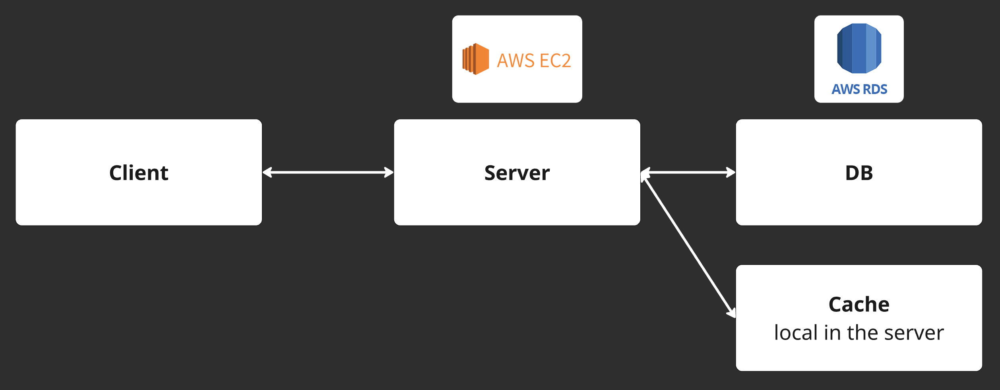
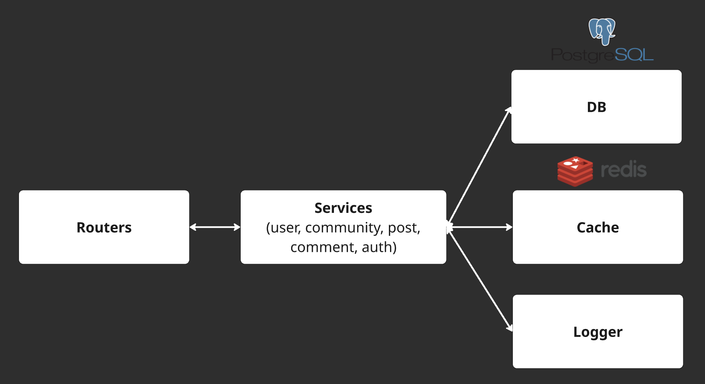
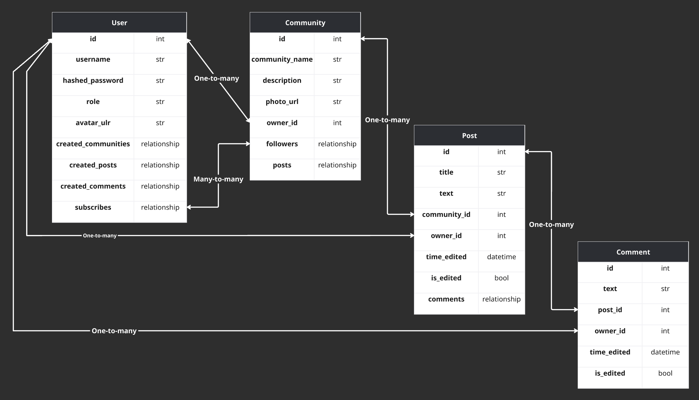
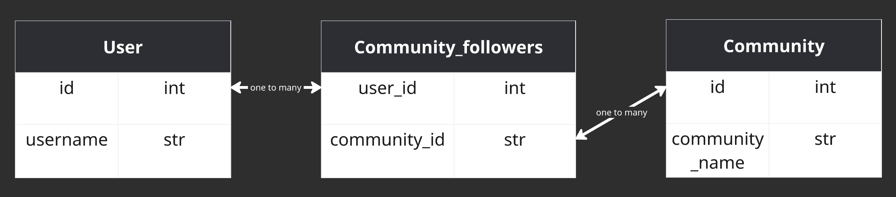

# Mini Social Network – Users, Communities, Posts, Comments

### This project is already hosted in aws with RDS and EC2

**Link to server:** http://56.228.23.236:8000/docs  

*Yes, I know it uses HTTP instead of HTTPS — but I don't know how to use NGINX to create the HTTPS connection.*


*Schema of aws modules*


## Application architecture

A minimal social networking backend similar to Reddit.  
Includes:

- **Relational database** with 4 tables and many-to-many relationships
- **Caching** using Redis
- **Structured logging** with contextual information via middleware


  
*Schema of application modules*

---

## 🗃️ Database Schema

Relational model with four main tables: `User`, `Community`, `Post`, and `Comment`.  
Includes a many-to-many relationship between users and communities (followers/subscribers) implemented via an association table.



### Many-to-Many Relationship

To represent a many-to-many connection (e.g., users following communities), we use an intermediate table. This results in two one-to-many relationships.

  
*Many-to-many connection schema*

---

## 📝 Structured Logging

Structured logging is implemented at the **middleware level**.  
User context (`user_id`, `user_role`) is extracted from JWT tokens in cookies and saved using `ContextVar`.  
This context is automatically added to logs.

### Example Log Output

```json
{
   "comment_id": 5,
   "event": "comment_created",
   "request_id": "dba80a8c-80b9-48e5-a5e7-062032fe95b0",
   "user_id": 5,
   "user_role": "user",
   "ip": "127.0.0.1",
   "timestamp": "2025-08-07T21:15:13.343010Z",
   "level": "info",
   "filename": "comment_service.py",
   "func_name": "create_comment"
}
